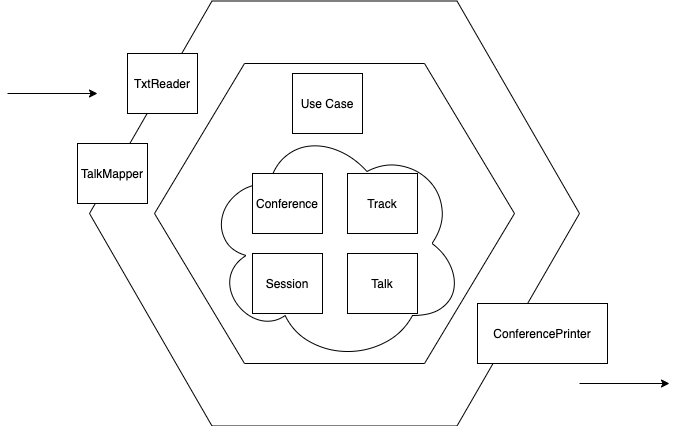

# TW Assignment - Conference Track Management

## How to
1. Run
```shell
shell> `./gradlew run`
```
Execute whole project to show inputs and outputs.

2. Test
```shell
shell> `./gradlew test`
```
Run all tests.

## Design


1. Core concepts
- *Conference*: Contains all info and operations about a confernce. Create and hold *Tracks*.
- *Tracks*: Contains morning *Session* and afternoon *Session*. Responsible for arrange *Talk* to *Session*.
- *Session*: Contains *Talks* and begin/end time.
- *Talk*: Hold *Talk* name and durations.

2. Adapters
- *TxtReader*: Read txt file content to string list.
- *TalkMapper*: Map string format *Talk* descritpion to *Talk* object.
- *ConferencePrinter*: Print Conference content with fixed format to output stream.

3. Use case
- *ArrangeConferenceUseCase*: read *Talk* descriptions from txt file, build conference then print.